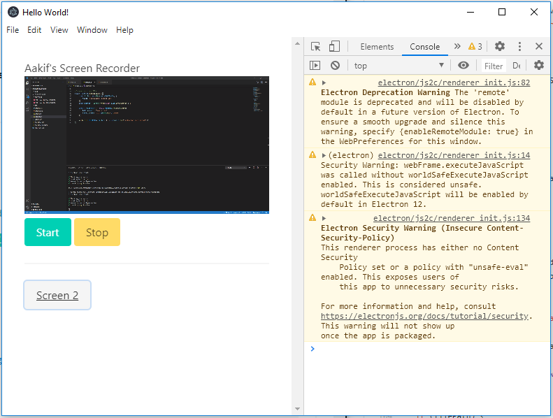

# Screen-Recorder
A simple screen recording desktop application built using ElectronJS; useful for making my video demos!

### Description
I used this project as an introduction to ElectronJS. Although not a complete recording tool, the project
in its current state can be used to record the video stream of my desktop. It's already viable enough
to be used for screen recording, and I'll be sure to work on this later to add some other functionalities.

### Future Work
* Add sound functionality _(pretty simple, just need to enable in render.js)_
* Add voice recording functionality
* Support other video extensions _(this might already be implemented, need to run tests)_
* Beautify the application's UI

### Gallery
